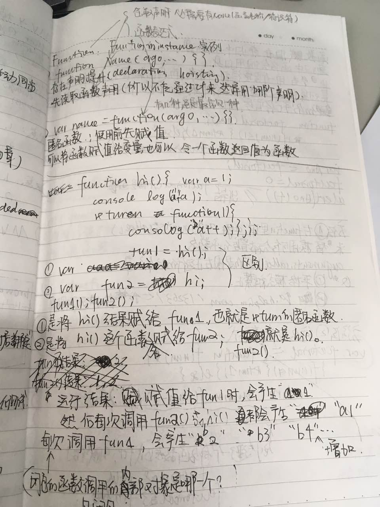
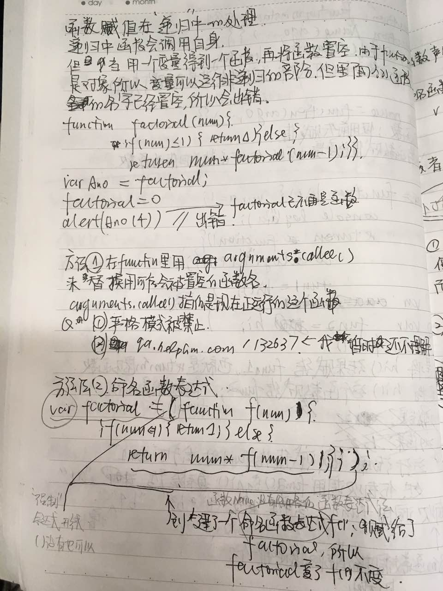
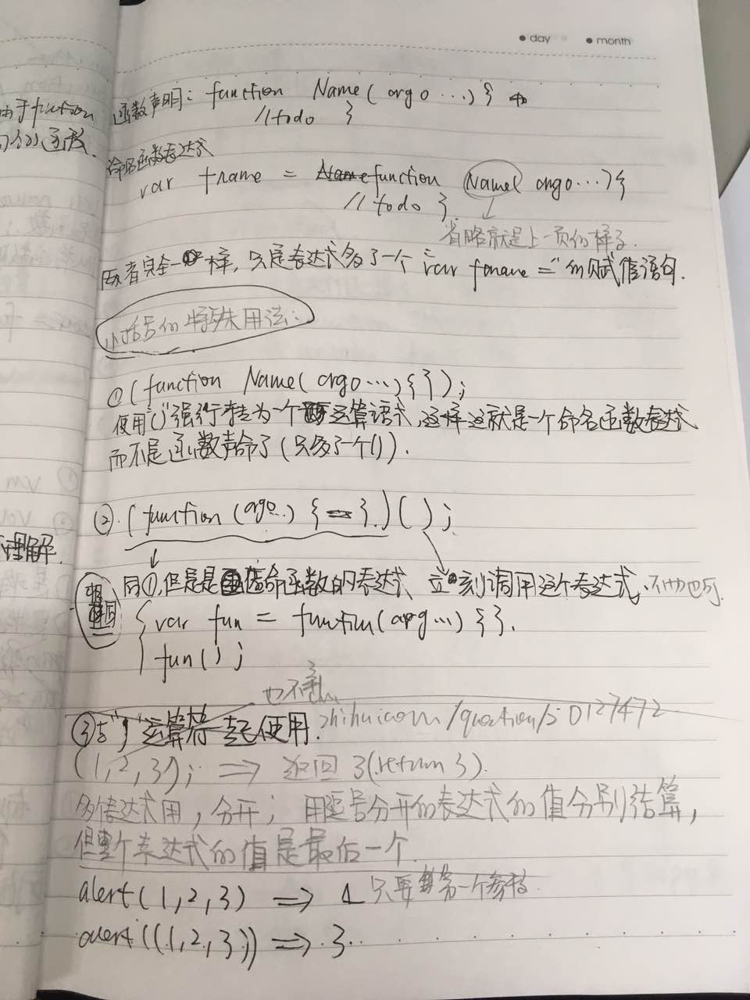
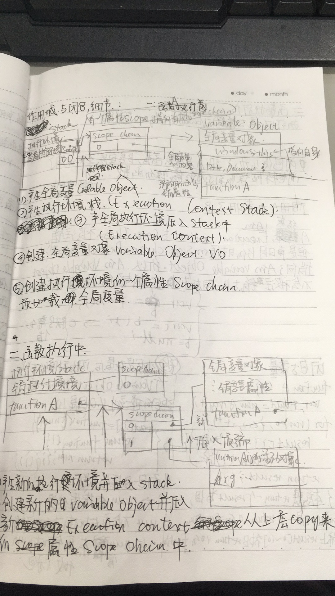
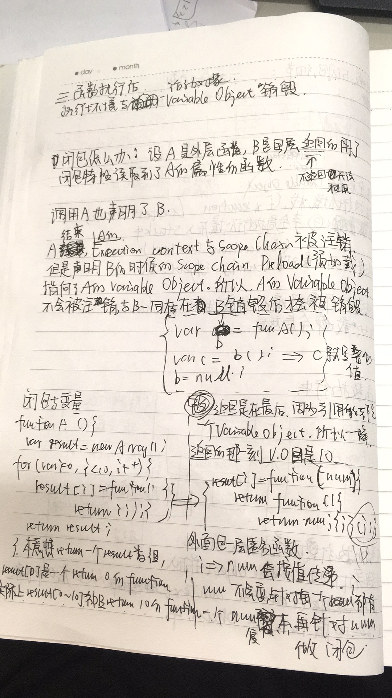

# js入门书 - JavaScript高级程序设计

# 第07章：函数 笔记

#### 其他参考资料

[What is the Execution Context & Stack in JavaScript? by DavidShariff](http://davidshariff.com/blog/what-is-the-execution-context-in-javascript/#first-article)

[Identifier Resolution and Closures in the JavaScript Scope Chain  by DavidShariff](http://davidshariff.com/blog/javascript-scope-chain-and-closures/#first-article)

[深入理解JS 执行细节](http://www.cnblogs.com/onepixel/p/5090799.html)

####第一部分 函数

#### 第二部分 递归

#### 第三部分 小括号的特殊用法

#### 第四部分 闭包

