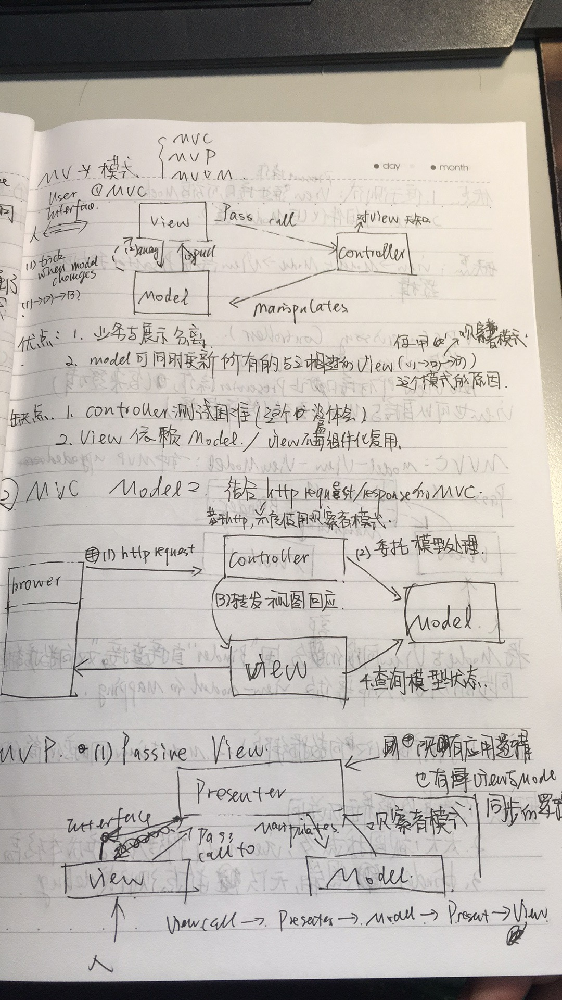
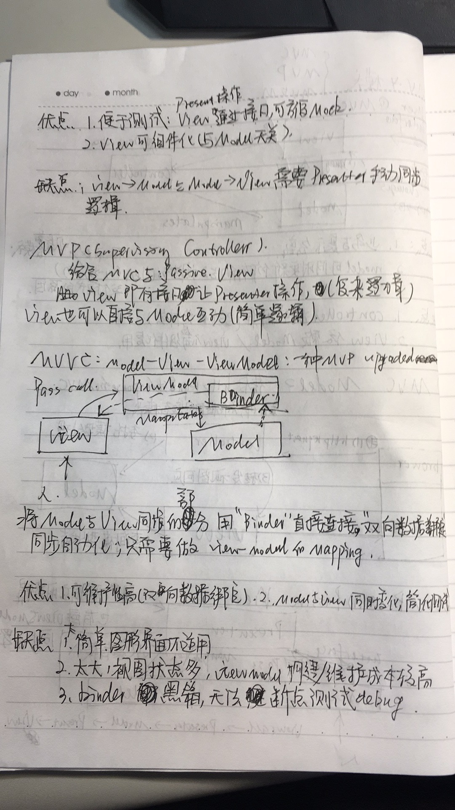

# 讲解各种MV*模式*

### MV*是什么

- 解决图形界面应用程序复杂性管理问题而产生的应用架构模式

###参考资料

- https://github.com/livoras/blog/issues/11
- [Servlet & JSP教學手冊(第二版)](http://www.books.com.tw/products/0010515154) chapter 1.2.3

